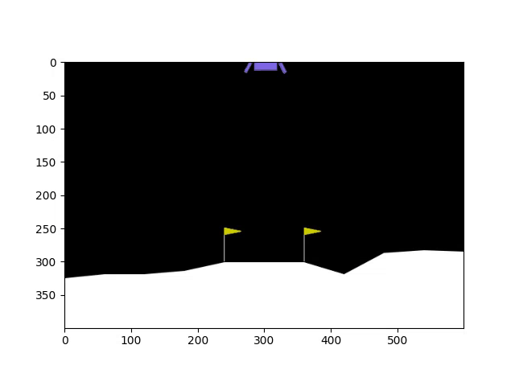

# Lunar Lander Reinforcement Learning Agent

An actor–critic reinforcement learning agent implemented in PyTorch to solve the LunarLander-v2 environment [LunarLander-v2](https://gym.openai.com/envs/LunarLander-v2/). 

The agent learns stable landing policies through policy gradients and value function approximation.

The project includes a full training pipeline, GPU support, performance tracking, and visual evaluation through rendered episodes.

**Tech:** Python, PyTorch, OpenAI Gym, NumPy

---

## What I Implemented
- Actor–critic neural network with shared features and separate policy/value heads
- Training loop with reward tracking and return normalization
- Early stopping based on average reward
- GPU training support
- Policy evaluation with rendering and GIF export
- Modular structure for experimenting with other environments

---

## Algorithm
The agent uses an actor–critic architecture trained with policy gradients.  
The actor outputs action probabilities, while the critic estimates the value function.  
Training uses episodic returns, normalization, and early stopping based on average reward.

---

## Requirements

This project depends on the following Python packages and system libraries:

- `numpy`  
- `gym` (with Box2D support)  
- `matplotlib`  
- `pyvirtualdisplay`  
- `moviepy`  
- `torch` (PyTorch)  
- `tqdm`  

### Python package installation

Use the following command to install all necessary Python packages:

```bash
pip install -r requirements.txt
```


**⚠️ Warning:**  
This repository is designed to be run primarily from **Google Colab**.  
Running the setup and installation commands on your local machine may cause conflicts or mess up your system, especially due to system-level package installations required for Box2D support.  
If you wish to run locally, please carefully follow official installation instructions for Gym and its dependencies.

Google Colab runs on virtual machines that reset every session, so you need to install some system and Python packages each time you start a new session to run this project successfully, especially to support Gym’s Box2D environments and rendering.


<a href="https://colab.research.google.com/github/NudelMaster/lunar-lander-rl/blob/main/notebooks/colab_run.ipynb" target="_parent"></a>

For Gym’s Box2D support, you might need additional system packages depending on your OS. See the official Gym documentation for details.

<a href="https://gymnasium.farama.org/introduction/gym_compatibility/" target="_parent">


</a>


### Lunar Lander Reinforcement Learning Videos

Before Training


---

After Training (1500 iterations with lr==1e-2)

- 

